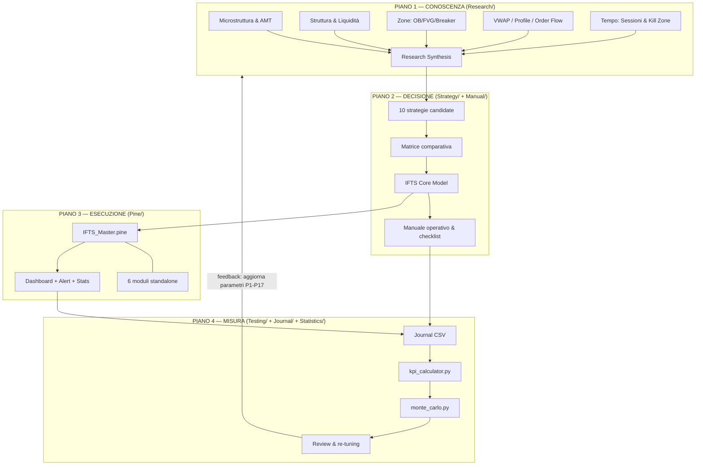
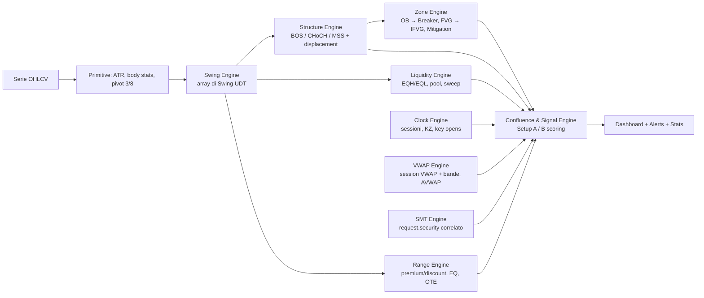
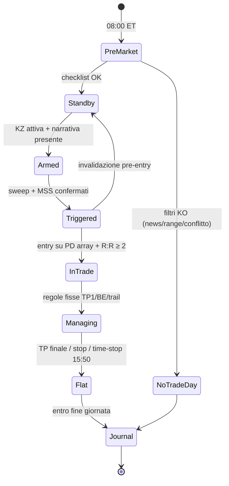

# 01 — Architettura del Sistema

## 1. Vista d'insieme

IFTS è organizzato in **quattro piani** che si alimentano a vicenda. La separazione è deliberata:
ogni piano può evolvere senza rompere gli altri, purché rispetti i contratti definiti in
`00_Conventions_and_Specs.md`.

**Il loop è chiuso:** la misura (piano 4) rialimenta la conoscenza (piano 1). Un sistema senza
feedback loop degrada; per questo journal e KPI non sono accessori ma componenti architetturali.

---

## 2. Contratti tra i piani

| Interfaccia | Contratto | Dove è definito |
|---|---|---|
| Research → Strategy | Solo concetti con evidenza ≥ E3 possono diventare regole; E4 solo come confluenza opzionale | `00_Conventions` §6 |
| Strategy → Pine | Ogni regola del Core Model ha un modulo/parametro Pine corrispondente con lo stesso nome e default | `Strategy/21` §Mappatura |
| Pine → Journal | I campi della dashboard (bias, KZ, setup, R) corrispondono 1:1 alle colonne del journal | `Journal/journal_schema.csv` |
| Journal → Statistics | Schema CSV fisso; i tool Python validano lo schema prima di calcolare | `Statistics/Tools/` |
| Statistics → Research | Un KPI fuori banda per 2 review consecutive apre una "research question" | `Manual/04` §Routine |

---

## 3. Architettura del codice Pine

### 3.1 Perché un Master + moduli standalone (e non una libreria)

Tre opzioni valutate:

| Opzione | Pro | Contro | Verdetto |
|---|---|---|---|
| (a) Libreria TradingView + moduli importanti | zero duplicazione | le librerie richiedono pubblicazione sull'account TV → frizione per il cliente; versioning fragile in vendita B2B | ❌ roadmap v2 |
| (b) Solo Master monolitico | un file, deploy immediato | chi vuole solo le sessioni carica tutto; limite oggetti condiviso | ❌ insufficiente |
| **(c) Master autonomo + 6 moduli standalone autonomi** | deploy immediato di entrambi; à-la-carte; limiti oggetti separati per modulo | duplicazione controllata delle primitive (pivot, ATR) tra file | ✅ **scelta v1** |

La duplicazione dell'opzione (c) è **isolamento da deployment deliberato** (~80 righe di primitive
per file), non debito accidentale; è documentata e i moduli condividono il naming dei parametri,
quindi la manutenzione resta O(1) per concetto a livello di *design* (il valore canonico sta in
`00_Conventions`).

### 3.2 Pipeline interna del Master

Ordine di valutazione fisso e senza cicli: **primitive → strutture → zone → contesto → segnale →
output**. Ogni engine scrive solo nei propri array; il Signal Engine legge tutto ma non modifica
nulla (separazione read/write che previene bug di stato).

### 3.3 Gestione dei limiti di piattaforma

| Limite TradingView | Mitigazione |
|---|---|
| max 500 box/lines/labels | cap per-modulo configurabile (default 50/tipo) con FIFO delete |
| tempo di esecuzione per barra | moduli disattivi = zero lavoro (guard clause a inizio blocco) |
| `request.security` budget (40) | max 3 richieste (HTF bias, SMT sym1, SMT sym2), gate `dynamic_requests` |
| repaint dei pivot | segnali solo su `barstate.isconfirmed` + lag dichiarato |

---

## 4. Flusso decisionale del trader (runtime umano)

Il Pine non decide: **disegna, misura, allerta**. Lo stato "Armed→Triggered" è assistito dagli
alert del Signal Engine ma la responsabilità del contesto resta al trader (per design: la parte
non codificabile — news, tono del delta, qualità del movimento — è dove il discrezionale aggiunge
valore).

---

## 5. Decisioni architetturali chiave (ADR sintetici)

**ADR-1 — Discrezionale sistematizzato, non automazione.**
Motivo: i concetti price-action qui usati hanno definizioni con margini interpretativi; automatizzarli
integralmente in Pine `strategy{}` produce backtest fragili (fill simulati su wick, no slippage MBO).
Scelta: indicatore + manuale a regole strette + journal. L'automazione è roadmap dopo n≥300 trade
loggati.

**ADR-2 — ES/NQ soltanto.**
Motivo: massima liquidità, costi di transazione minimi, correlazione sfruttabile (SMT), sessioni
regolari, prop-firm friendly. Aggiungere mercati diluisce il campione statistico per setup.

**ADR-3 — ET ovunque.**
Motivo: le kill zone sono fenomeni legati all'equity USA; ancorare a ET con DST automatico elimina
un'intera classe di errori (i più comuni nei toolkit retail).

**ADR-4 — R come unità di misura.**
Motivo: rende confrontabili trade, giorni, strategie e simulazioni Monte Carlo indipendentemente
da size e capitale.

**ADR-5 — Statistica on-chart minimale ma onesta.**
Il modulo Statistics del Pine conta eventi e follow-through *osservabili sul grafico corrente*
(es. % FVG riempiti). Non pretende di essere un backtest: serve da sanity check di calibrazione
parametri sul singolo strumento/TF.
